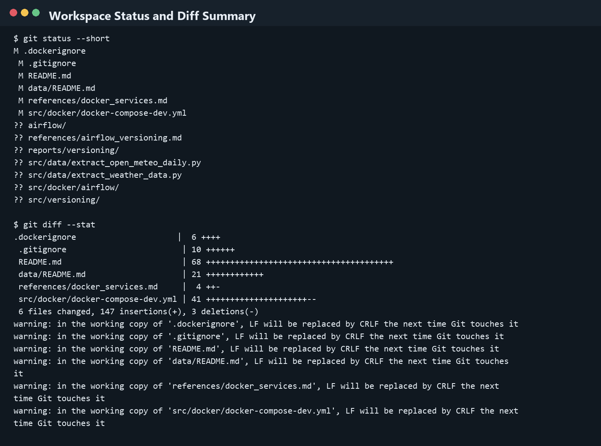
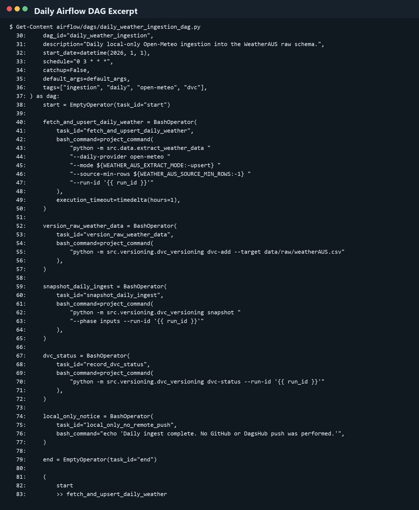
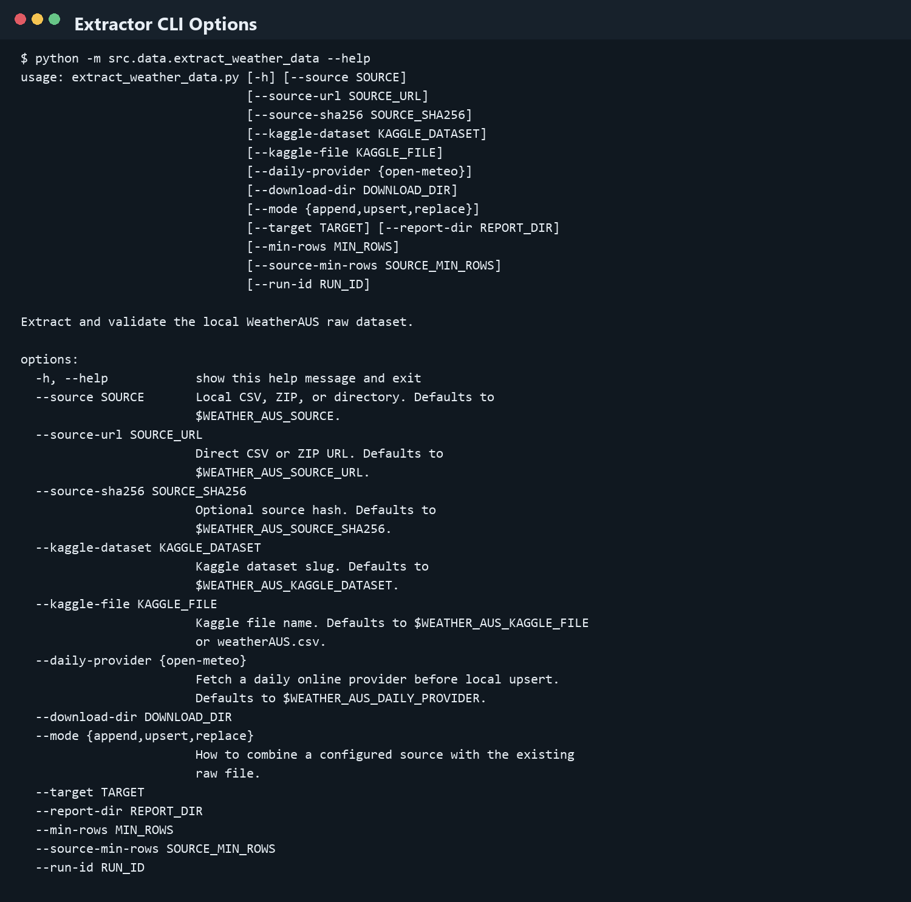
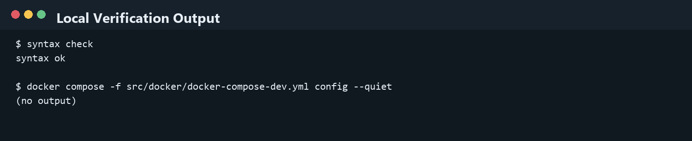
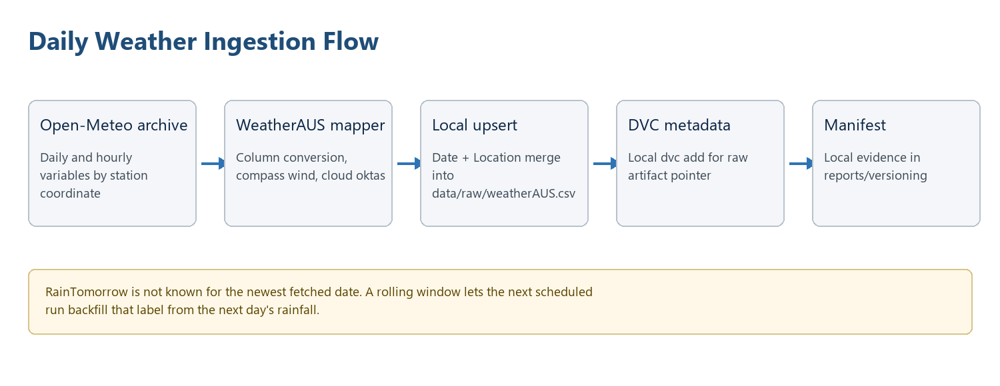

# End-to-End Airflow and FastAPI Orchestration Record

Date: 20 June 2026  
Repository: rain_prediction_mlops  
Scope: local workspace only

## Project Decision

Andrey's FastAPI work is the official API layer for the project. The API source is `src/prediction_api/main.py`, and the root Docker stack is the deployment base for FastAPI, Nginx, Prometheus, Grafana, node-exporter, and Airflow.

The older local API draft in `src/models/api.py` remains in the workspace for now, but it is not the production API target. The Airflow validation step now points to the official FastAPI contract.

No GitHub push and no DagsHub push were performed.

## Why Andrey's Files Were Touched

Andrey's FastAPI and Nginx work was kept as the project API and security gateway. The touched files were integration points, not replacements.

| File or area | Reason |
|---|---|
| `src/prediction_api/main.py` | Kept as the official API used by Docker, Airflow validation, CI contract checks, Prometheus metrics, and Kubernetes. |
| `nginx/nginx.conf` | Kept as the authentication and rate-limit gateway. The upstream was aligned with Docker Compose service discovery so Nginx can reach scaled FastAPI containers through `fastapi:8502`. |
| `docker-compose.yml` | Expanded into the local project stack that runs FastAPI, Nginx, Prometheus, Grafana, Airflow, and automatic prediction traffic together. |
| `docker/prediction-api/api.Dockerfile` | Builds Andrey's official FastAPI application with the served model available inside the container. |
| `tests/test_prediction_api_contract.py` | Adds a lightweight local contract check for Airflow and CI. It does not replace Andrey's running-stack Nginx/API tests. |
| `prometheus/` and `grafana/` | Connected the API metrics to local monitoring and made the dashboards load with live project metrics. |

The API behavior, Nginx authentication flow, and role-based access decisions remain owned by the API/security work. The integration work only made those pieces usable from orchestration, monitoring, Docker Compose, and Kubernetes.

## Repository Check

The remote repository contained a newer `origin/main` with Andrey's additions. The important commit was:

`2f86ee2 Add all project files and update DVC config, Andrey Gerber`

The added stack contained:

- `src/prediction_api/main.py`
- root `docker-compose.yml`
- root `docker/`
- root `nginx/`
- root `prometheus/`
- root `grafana/`
- root `tests/`

Those files were copied into the local workspace from `origin/main` without merging or pushing.

## Official API Layer

The official API now uses FastAPI from `src/prediction_api/main.py`.

Public endpoints:

- `GET /health`
- `GET /locations`
- `GET /docs`
- `GET /openapi.json`

Protected prediction endpoints:

- `POST /predict`
- `POST /predict/batch`

Admin endpoints:

- `GET /model/info`
- `GET /model/features`

The API loads the final winner model from:

`models/final_winner/winner_model.joblib`

The local model artifact exists in the workspace, so the API can load the trained winner model locally.

## Nginx Layer

Andrey's Nginx configuration remains the security gateway for the API. It provides:

- HTTPS entry point
- Basic Authentication
- forwarded username header through `X-Forwarded-User`
- rate limiting for prediction endpoints
- public access for health, locations, docs, and OpenAPI schema
- protected access for prediction, model metadata, and metrics

The local Docker Compose upstream was adjusted to use the Compose service name:

`fastapi:8502`

The certificate files are treated as local runtime files under:

`nginx/certs/`

Only `nginx/certs/.gitkeep` is tracked. Certificate keys and certificate files are ignored locally.

## Docker Compose Stack

The root `docker-compose.yml` is now the project-level orchestration file.

Services included:

- `fastapi`
- `nginx`
- `prometheus`
- `grafana`
- `node-exporter`
- `airflow`
- `prediction-traffic`

The FastAPI image is built from:

`docker/prediction-api/api.Dockerfile`

The Nginx image is built from:

`docker/gateway/nginx.Dockerfile`

The Airflow image is built from:

`docker/airflow/airflow.Dockerfile`

Airflow receives the project folder at:

`/opt/airflow/project`

Airflow receives DAG files from:

`airflow/dags`

## Airflow Orchestration

The end-to-end DAG is:

`airflow/dags/end_to_end_mlops_dag.py`

The DAG flow is:

1. start
2. extract raw weather data
3. version raw weather data with DVC
4. verify local versioned inputs
5. snapshot input versions
6. train the winner model
7. version the model artifact with DVC
8. snapshot output versions
9. validate the official FastAPI contract
10. record DVC status
11. local-only completion notice
12. end

The API validation task now uses:

`tests/test_prediction_api_contract.py`

This keeps the Airflow pipeline aligned with Andrey's official FastAPI app.

## Daily Data Automation

Daily data ingestion remains separated from the historical Kaggle dataset. The project has a daily ingestion DAG:

`airflow/dags/daily_weather_ingestion_dag.py`

The daily ingestion path uses the Open-Meteo based extractor and stores the result in the WeatherAUS raw schema. The data is versioned locally with DVC after ingestion.

The key rule remains the same: `RainTomorrow` is only known after the next day. New live data can be ingested daily, but final labeled training rows become complete only after the label delay has passed.

## Versioning

DVC is used for local data and model version tracking.

Local versioning code:

`src/versioning/dvc_versioning.py`

Versioning outputs are recorded under:

`reports/versioning/`

The pipeline performs local `dvc add` and local status snapshots. It does not push to DagsHub.

## API Contract Test

A new local test file was added:

`tests/test_prediction_api_contract.py`

It checks:

- the FastAPI app loads the final model
- `/health` returns a healthy response
- `/locations` returns the expected location contract
- `/predict` requires a forwarded user
- `/predict` returns the prediction response contract when a user is forwarded by Nginx
- `/model/info` is available to an admin user
- `/model/info` is blocked for a normal user

This test is suitable for Airflow because it does not require the full HTTPS Nginx stack to be running.

Andrey's original integration tests remain in the root `tests/` folder. Those tests target the running Docker/Nginx environment and are better suited for the Docker or CI stage.

## Screenshots

Daily ingestion setup screenshots are stored in:

`reports/figures/daily_ingestion_documentation/`

## Current State

The local project now has:

- Andrey's FastAPI app as the official API layer
- Nginx as the security gateway
- Prometheus and Grafana as the monitoring stack
- Airflow included in the root Docker Compose stack
- Airflow DAG validation aligned to the official FastAPI app
- local DVC versioning for data and model artifacts
- daily ingestion separated from historical Kaggle ingestion
- automatic prediction traffic for every supported location, used only to keep monitoring dashboards populated
- production-style local Kubernetes manifests for FastAPI and separated Airflow services
- local CI workflow preparation without pushing to GitHub

API security hardening and MLflow tracking remain with the teammates responsible for those areas.
